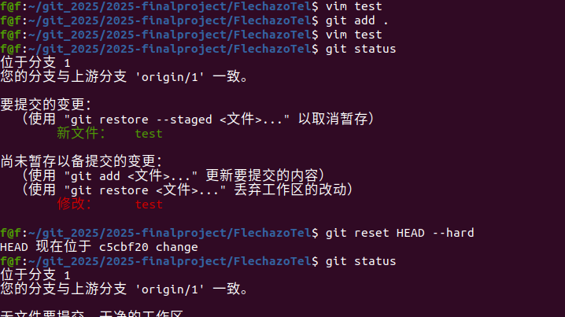
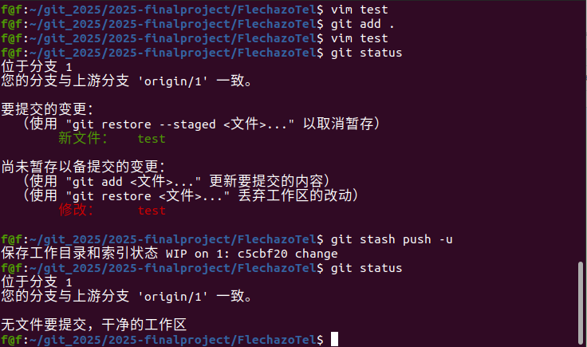
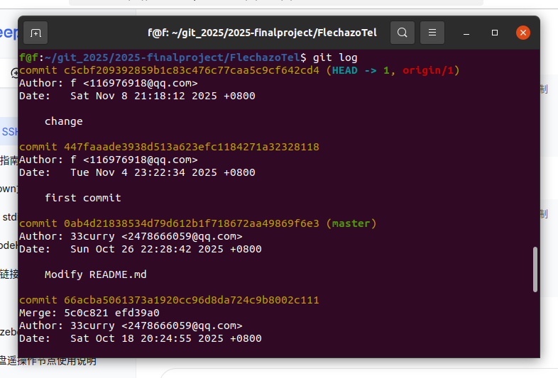
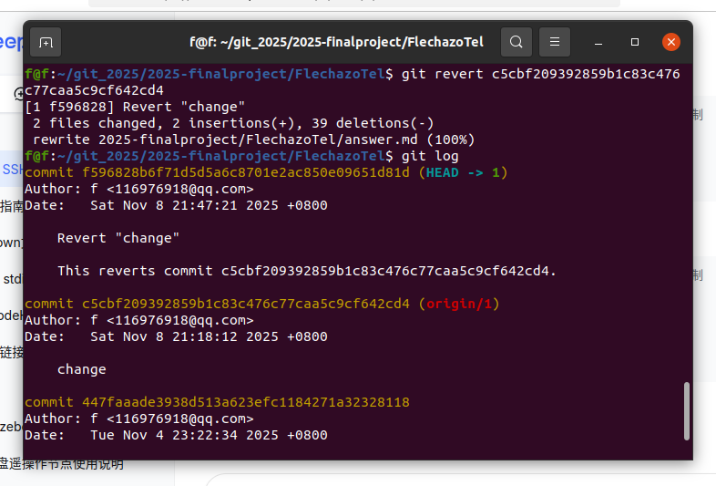
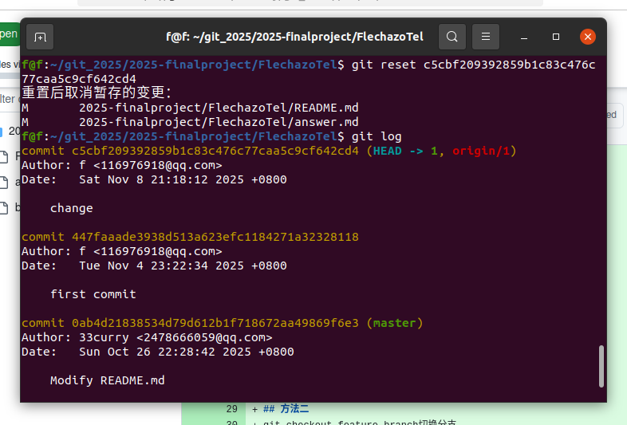
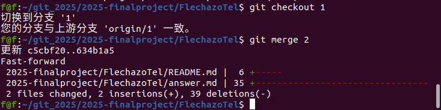

# 第一题
## 方法一

git reset HEAD --hard
回退至最新版本 覆盖工作区和暂存区达到清除的效果

## 方法二
git reset HEAD 首先覆盖暂存区
git checkout -- 覆盖工作区

## 方法三
git stash push -u
将工作区和暂存区丢到临时空间

# 第二题
## 不修改历史
git revert 回退版本的哈希值
直接创建一个与旧版本相同的新提交
寻找想要回退的版本

revert后的版本历史

## 修改历史
git reset 旧版本的哈希值
直接回退版本
对比上图的历史，原本revert创建的历史没了

# 第三题
## 方法一
git checkout 分支
git rebase 主枝
通过rebase将分支变基到主枝 

## 方法二
git checkout feature-branch切换分支
git format-patch main --stdout > feature.patch生成补丁
切换到主分支并应用补丁
git checkout main
git apply feature.patch

