# Git应用

##### 一、**若你已经修改了部分文件、并且将其中的一部分加入了暂存区，应该如何回退这些修改，恢复到修改前最后一次提交的状态？给出至少两种不同的方式**

1.分步回退，可以精准控制回退的范围 

```
#1.将暂存区的文件取消暂存
git reset <文件名>
```

* 将1.txt文件添加后，使用git reset命令取消暂存

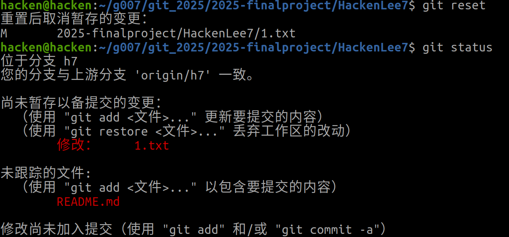    

```
#2.丢弃工作区文件的修改
git checkout -- <文件名>
```

* 使用git checkout命令丢弃修改

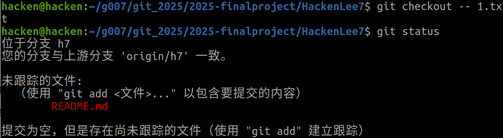

2.强制重置，内容将不存在

```
#一次性重置暂存区与工作区
git reset --hard HEAD
```

* 首先删除1.txt文件，然后新增2.txt文件

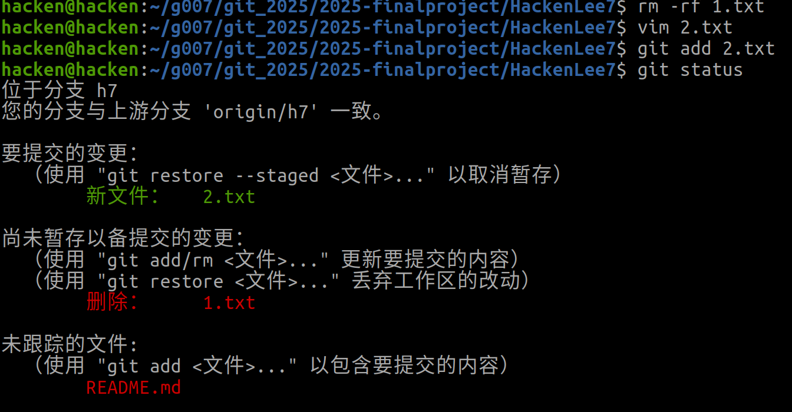

* 然后使用git reset --hard HEAD命令重置

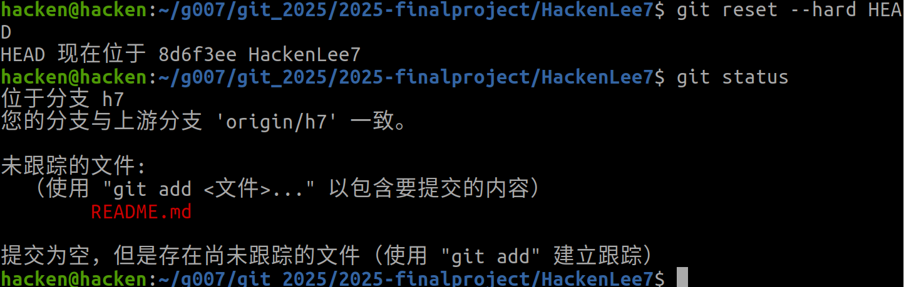

##### **二、若你已经提交了一个新版本，需要回退该版本，应该如何操作？分别给出不修改历史或修改历史的至少两种不同的方式**

1.不修改历史

* 使用`git revert`命令

```
#回退一个提交
git revert <hash>

#回退最近的一次提交
git revert HEAD
```

* 回退一次提交，先创建一个test，并将test用git commit命令提交

  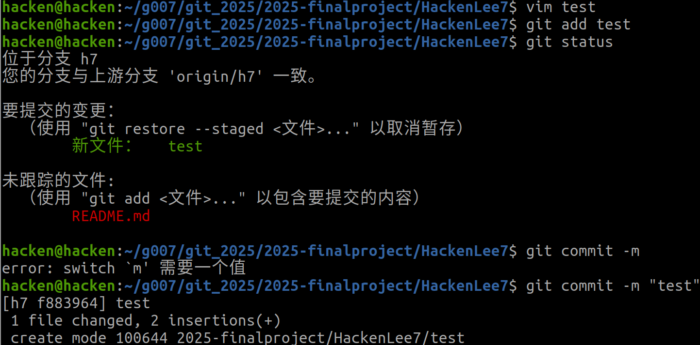

* 通过git log 命令获取hash并用git revert命令回退

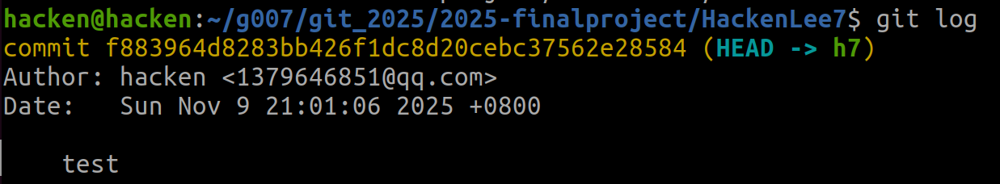

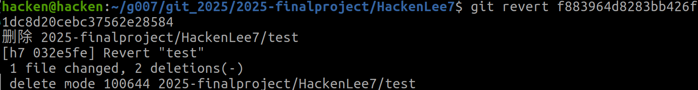

* 使用`git checkout`命令

```
#将单个文件恢复到指定提交的状态
git checkout HEAD~1 -- <文件名>
```

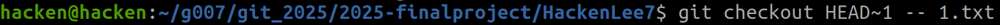

2.修改历史

* 使用`git reset`命令

``` 
# 回退到其他版本
git reset --soft <hash>
```

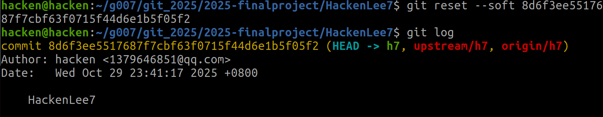

* 使用`git rebase`命令

  ```
  #重写到特定提交
  git rebase -i <特定hash>
  ```

  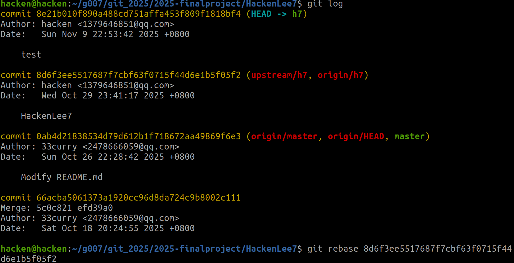

  **三、我们已经知道了合并分支可以使用merge，但这不是唯一的方法，给出至少两种不同的合并分支的方式**

1.使用`git rebase`命令

```
#切换分支，使用rebase命令
git checkout <branch>
git rebase <other branch>

#合并
git checkout <other branch>
git merge <branch>
```

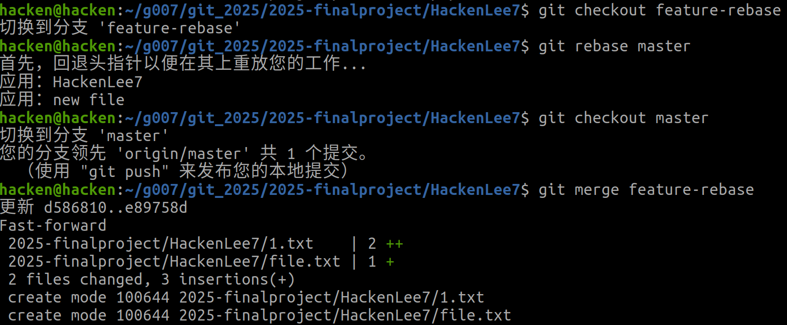

2.使用`git cherry-pick`命令

```
#在其他分支里面操作
git checkout <other branch>

#选择需要的hash部分进行merge
git cherry-pick <目标hash>
```

* 通过`git log --oneline`获取更改过的hash

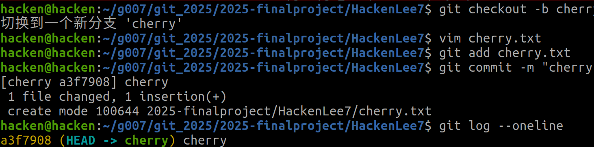

* 使用`git checkout <branch>`回到分支，再使用`git cherry-pick`进行merge

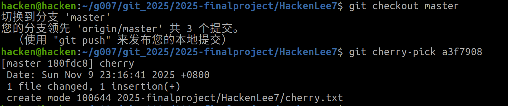