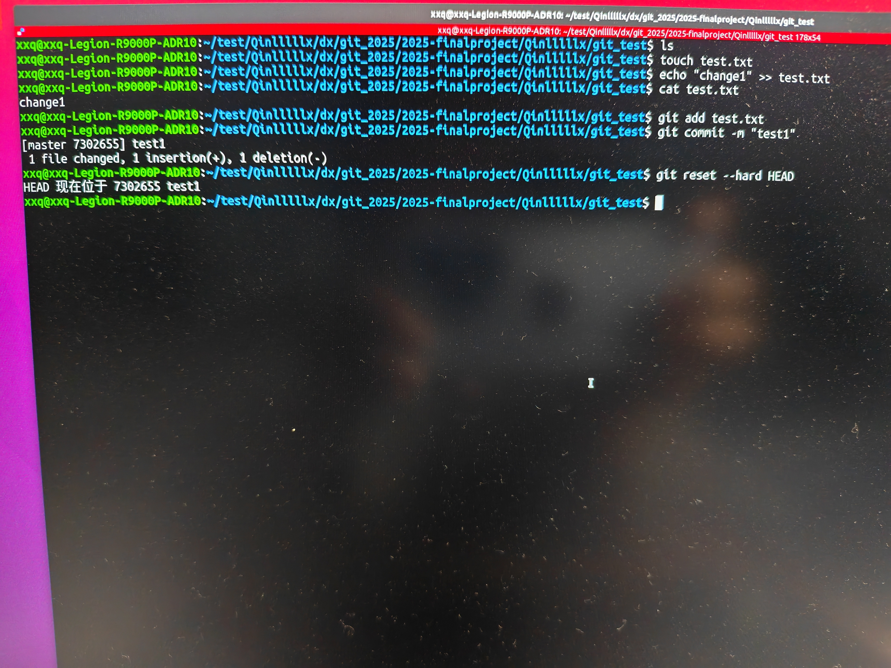
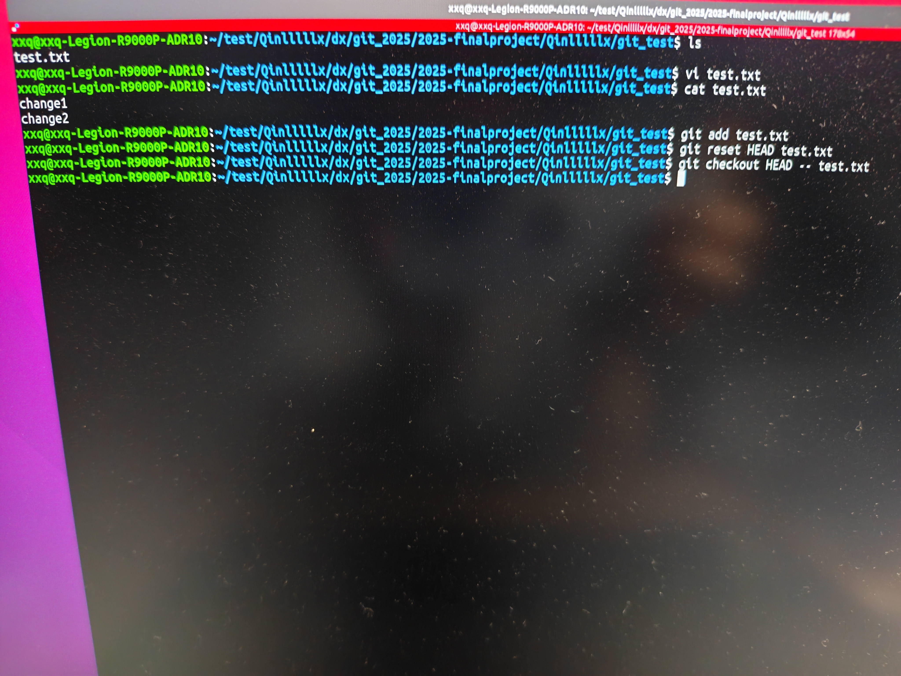
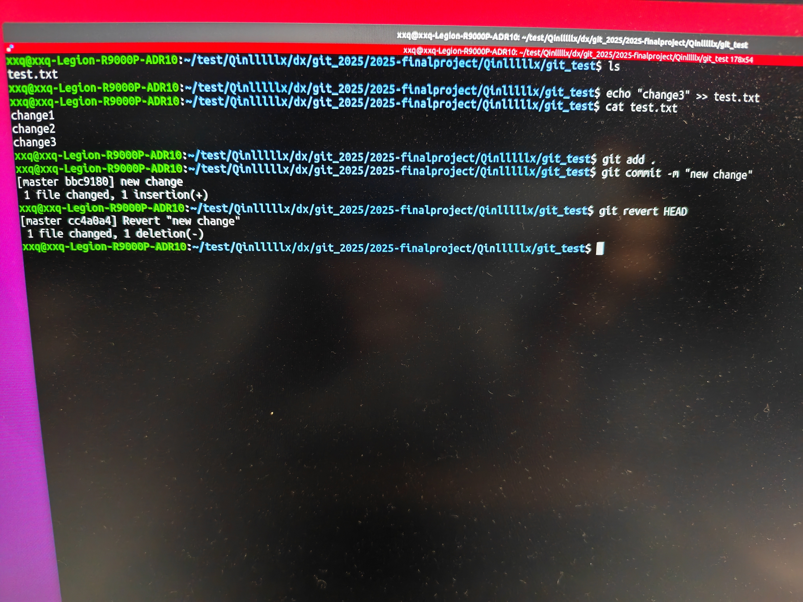
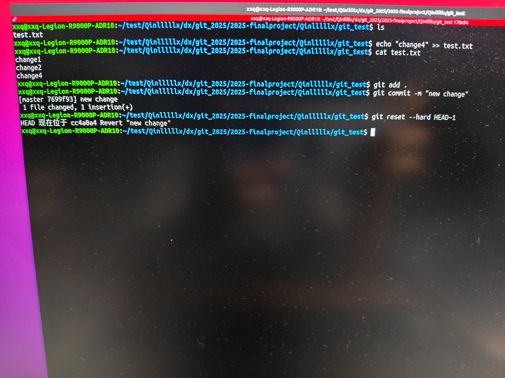

##问题1：若你已经修改了部分文件、并且将其中的一部分加入了暂存区，应该如何回退这些修改，恢复到修改前最后一次提交的状态
?给出至少两种不同的方式

###方法一:全部丢弃工作区和暂存区的修改
```bash
git reset HEAD --hard


###方法二:仅取消暂存，保留工作区修改
```bash
git reset HEAD <文件名>
git checkout HEAD -- <文件名>



##问题2:若你已经提交了一个新版本，需要回退该版本，应该如何操作？分别给出不修改历史或修改历史的至少两种不同的方式

###方法一:不修改历史
```bash
git revert HEAD


###方法二:修改历史
```bash
git reset --hard HEAD~1


##问题3:我们已经知道了合并分支可以使用merge，但这不是唯一的方法，给出至少两种不同的合并分支的方式

###方法一:使用git rebase
```bash
git checkout master
git rebase feature-branch


###方法二:使用git cherry-pick(仅选取某一次提交应用到当前分支)
```bash
git log feature-branch --oneline #获取哈希值
git cherry-pick <哈希值>

