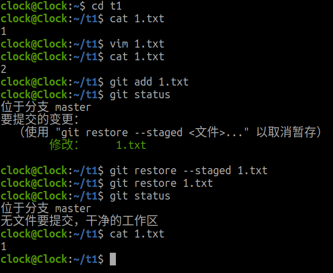
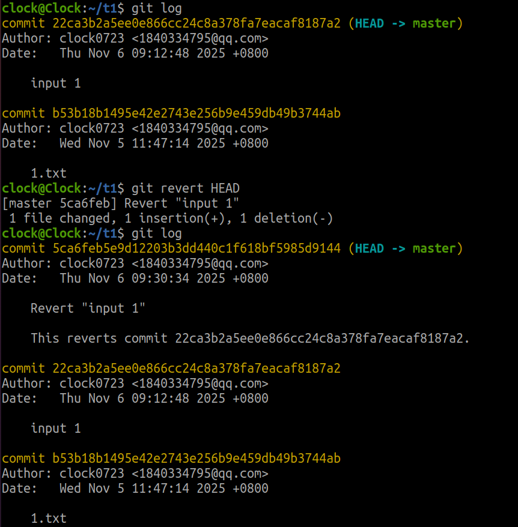
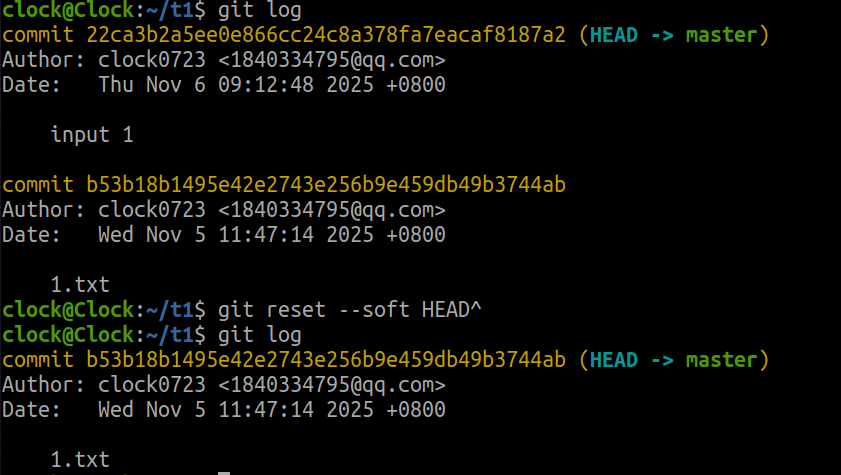
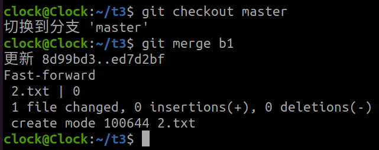
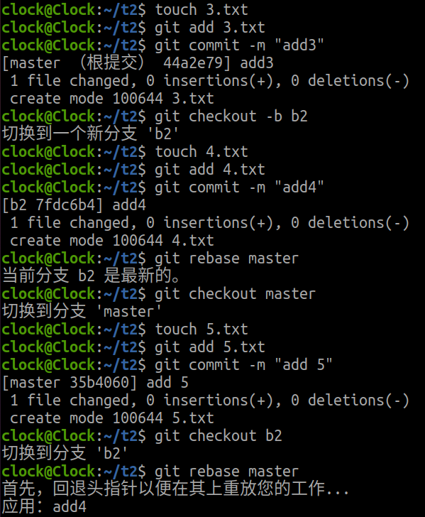

#我的答案

##任务一

###方法一
 使用git reset --hard HEAD撤销所有修改

###方法二
 使用git restore 选择文件分步撤销修改（已add加--staged，没有不用加）

##任务二

###方法一
 使用git revert回退版本（不修改历史）

###方法二
 使用git reset回退版本（修改历史）

##任务三

###方法一
使用git merge合并分支

###方法二
使用git rebase合并分支

